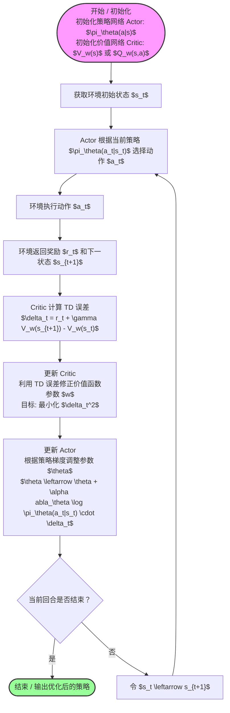

整理自西湖大学——赵世钰《【强化学习的数学原理】课程：从零开始到透彻理解》深受启发，所悟甚多，遂整理到博客上

视频链接：https://www.bilibili.com/video/BV1sd4y167NS/

## 强化学习基础

Agent / Environment / State / Action / Reward / Return / Policy / Episode

### 1. 核心概念 (Concepts)

这些词汇构成了智能体（Agent）与环境（Environment）交互的语言：

State (状态, S)：对环境在某一时刻的完整描述。它告诉智能体“现在是什么情况”。

Action (动作, A)：智能体在特定状态下可以采取的选择。

Reward (奖励, R)：环境对智能体动作的即时反馈。它是标量值，告诉智能体刚才那一步做得“好”还是“坏”。

Return (回报, G)：从当前时刻开始到结束，智能体获得的所有未来奖励的总和。通常会加上折扣因子（Discount Factor, $\gamma$）来平衡眼前和长远利益。

Episode (回合/幕)：从开始到结束的一个完整交互序列。

Policy (策略, \pi)：智能体的“大脑”，本质上是一个映射函数。它决定了在状态 s 下，智能体应该选择哪个动作 a。

**补充理解：** 强化学习可以看成一个“序贯决策”问题。和一次性分类不同，智能体当前动作会改变未来状态分布，所以评价一个动作不能只看即时奖励，还要看它把智能体带向什么样的后续状态。

### 2. 网格世界示例 (Grid-world Examples)

网格世界是 RL 中最经典的入门模型，类似于一个简单的棋盘地图。

设定：智能体是一个小方块，目标是走到终点（Reward = +1），避开陷阱（Reward = -1），每走一步可能还有微小的负奖励（鼓励尽快到达）。

作用：它将抽象的数学定义具象化。通过网格世界，你可以直观地看到策略是如何演变的——从一开始的随机乱撞，到最后形成一条完美的直线路径。

## MDP 与价值函数

MDP 五元组、马尔可夫性、State Value、Action Value、Bellman Equation

### 3. 马尔可夫决策过程 (Markov Decision Process, MDP)

这是强化学习的数学基石。如果一个问题不能定义为 MDP，通常就很难用标准的 RL 算法解决。

MDP 由五个要素组成 (S, A, P, R, \gamma)：

S: 有限状态集合。

A: 有限动作集合。

P (状态转移概率)：在状态 s 下执行动作 a 后，进入下一个状态 s' 的概率。这体现了环境的动态性。

R (奖励函数)：获得奖励的数学期望。

\gamma (折扣因子)：取值在 [0, 1] 之间，决定了智能体有多“高瞻远瞩”。

马尔可夫性的核心思想是：“未来只取决于现在，而与过去无关。” 只要现在的状态信息足够全，你就不需要翻看历史记录来做决策。

**补充理解：** 马尔可夫性并不是说历史真的没有影响，而是当前状态表示已经吸收了足够的历史信息。如果状态表示不完全，问题就更接近 POMDP，需要用历史窗口、递归网络或 belief state 来补足可观测性。

### 4状态价值函数

**state value**

| 维度 | 回报 (Return, $G_t$) | 状态价值 (State Value, $v_{\pi}(s)$) |
| :--- | :--- | :--- |
| **定义公式** | $G_t = \sum_{k=0}^{\infty} \gamma^k R_{t+k+1}$ | $v_{\pi}(s) = \mathbb{E}[G_t \mid S_t = s]$ |
| **随机变量性** | 是（受环境和策略随机性双重驱动） | 否（它是统计期望，是确定的函数） |
| **物理意义** | 单次实验（样本轨迹）获得的实际收益 | 该状态出发在长期运行下的平均收益预期 |
| **确定性联系** | 若环境与策略均无随机性，两者数值相等 | 它是对随机轨迹波动的“抹平” |

引入折现率 $\gamma \in (0, 1)$ 不仅是为了符合“当下利益高于未来利益”的经济直觉，更是一个关键的数学手段：它确保了无穷级数的和是收敛的，从而将无限长的探索过程压缩进有限的数学表达中。

$$v_{\pi}(s) = \mathbb{E}[G_t \mid S_t = s]$$

| 符号 | 物理意义 | 备注 |
| :--- | :--- | :--- |
| $S_t, A_t$ | $t$ 时刻的状态与动作 | 随机变量 |
| $R_{t+1}$ | 执行 $A_t$ 后获得的即时奖励 | 依赖于 $p(r \mid s, a)$ |
| $\pi(a \mid s)$ | 策略 (Policy) | 在状态 $s$ 下采取动作 $a$ 的概率 |
| $p(s' \mid s, a)$ | 状态转移概率 | 环境的动态模型 (Dynamics) |
| $p(r \mid s, a)$ | 奖励概率分布 | 环境的奖励模型 |
| $G_t$ | 折扣回报 (Return) | 随机变量，表示长期总收益 |

### 5，贝尔曼公式（bellman equation）

贝尔曼公式的形式：（矩阵形式）

$$v_{\pi} = r_{\pi} + \gamma P_{\pi} v_{\pi}$$

$$
\begin{bmatrix}
v_{\pi}(s_1) \\
v_{\pi}(s_2) \\
v_{\pi}(s_3) \\
v_{\pi}(s_4)
\end{bmatrix}
=
\begin{bmatrix}
0.5(0) + 0.5(-1) \\
1 \\
1 \\
1
\end{bmatrix}
+ \gamma
\begin{bmatrix}
0 & 0.5 & 0.5 & 0 \\
0 & 0 & 0 & 1 \\
0 & 0 & 0 & 1 \\
0 & 0 & 0 & 1
\end{bmatrix}
\begin{bmatrix}
v_{\pi}(s_1) \\
v_{\pi}(s_2) \\
v_{\pi}(s_3) \\
v_{\pi}(s_4)
\end{bmatrix}.
$$

定义 $n$ 个状态的价值向量 $v_{\pi} = [v_{\pi}(s_1), \dots, v_{\pi}(s_n)]^T$。

- **策略奖励向量 ($r_{\pi}$)**: $r_{\pi}(s) = \sum_{a} \pi(a \mid s) \sum_{r} p(r \mid s, a) r$。
- **状态转移矩阵 ($P_{\pi}$)**: 其元素 $[P_{\pi}]_{ij} = p_{\pi}(s_j \mid s_i) = \sum_{a} \pi(a \mid s) p(s_j \mid s_i, a)$。

#### 3.1 递归逻辑推导

利用回报的定义：$G_t = R_{t+1} + \gamma G_{t+1}$。对两边取期望：

$$v_{\pi}(s) = \mathbb{E}[R_{t+1} + \gamma G_{t+1} \mid S_t = s] = \mathbb{E}[R_{t+1} \mid S_t = s] + \gamma \mathbb{E}[G_{t+1} \mid S_t = s]$$

#### 3.2 方程全貌（元素形式）

展开期望项，得到适用于所有状态 $s \in \mathcal{S}$ 的贝尔曼方程：

$$v_{\pi}(s) = \underbrace{\sum_{a} \pi(a \mid s) \sum_{r} p(r \mid s, a)r}_{\text{即时奖励均值 } r_{\pi}(s)} + \gamma \underbrace{\sum_{a} \pi(a \mid s) \sum_{s'} p(s' \mid s, a)v_{\pi}(s')}_{\text{未来奖励均值}}$$

实际上就是每个Action value在策略下的平均值

**补充理解：** Bellman 方程的核心是自洽性：一个状态的价值，应该等于当前奖励加上下一个状态价值的折扣期望。后续的动态规划、TD、Q-Learning 和 DQN，本质上都在用不同方式逼近这个自洽关系。

## 动态规划与蒙特卡罗方法

Policy Evaluation、Value Iteration、MC Basic、Exploring Starts、ε-Greedy

### 6,策略评估（policy evaluation）

给定一个policy—>列出他的贝尔曼方程—>求解这个贝尔曼公式，得到他的state value—>这个过程就叫policy evaluation

1. **闭式解 (Closed-form solution)**:

   $$v_{\pi} = (I - \gamma P_{\pi})^{-1} r_{\pi}$$

   - **技术备注**: 只要 $\gamma < 1$ 且 $P_{\pi}$ 是随机矩阵（行和为 1），矩阵 $(I - \gamma P_{\pi})$ 始终可逆。由于涉及矩阵求逆，计算复杂度为 $O(n^3)$。

2. **迭代解 (Iterative solution)**:

   $$v_{k+1} = r_{\pi} + \gamma P_{\pi} v_k$$

   - **收敛逻辑**: 由于 $\gamma < 1$，该算子满足压缩映射原理 (Contraction Mapping)，无论初始值 $v_0$ 如何，序列 $v_k$ 必收敛至 $v_{\pi}$。

一般采用第二种，计算量较低

### 7，Action value

$q_{\pi}(s, a)$ 是在状态 $s$ 采取特定动作 $a$ 后，遵循策略 $\pi$ 的期望回报：

$$q_{\pi}(s, a) = \mathbb{E}[G_t \mid S_t = s, A_t = a]$$

### 8，bellman最优公式

1. **分量形式 (Elementwise)**:

   $$v(s) = \max_{\pi(s) \in \Pi(s)} \sum_{a \in \mathcal{A}} \pi(a \mid s) q(s, a), \quad s \in \mathcal{S}$$

2. **矩阵向量形式 (Matrix-vector)**:

   $$v = \max_{\pi} (r_{\pi} + \gamma P_{\pi} v)$$

### 9，价值迭代 Value Iteration

$$
v_k(s) \xrightarrow{\text{计算}} q_k(s, a) \xrightarrow{\text{贪婪提取}} \pi_{k+1}(s) \xrightarrow{\text{最大值更新}} v_{k+1}(s)
$$

| 维度 | 价值迭代 (VI) | 策略迭代 (PI) |
| :--- | :--- | :--- |
| **价值计算深度** | 仅执行一次贝尔曼更新 ($j = 1$) | 执行无限次迭代直至收敛 ($j = \infty$) |
| **单步价值质量** | $v_1 = r_{\pi_1} + \gamma P_{\pi_1} v_0$ | $v_{\pi_1} = r_{\pi_1} + \gamma P_{\pi_1} v_{\pi_1}$ |
| **收敛速度特性** | 外部主迭代次数多，单步计算极快 | 外部主迭代次数极少，单步计算极重 |

**价值迭代 (Value Iteration) ① :**

1. **策略更新：** $\pi_{k+1} = \arg\max_\pi (r_\pi + \gamma P_\pi v_k)$
2. **价值更新：** $v_{k+1} = r_{\pi_{k+1}} + \gamma P_{\pi_{k+1}} v_k$

**策略迭代 (Policy Iteration) ② ③ :**

1. **策略评估：** $v_{\pi_k} = r_{\pi_k} + \gamma P_{\pi_k} v_{\pi_k}$ （若直接求逆求解，即 $v_{\pi_k} = (I - \gamma P_{\pi_k})^{-1} r_{\pi_k}$）
2. **策略改进：** $\pi_{k+1} = \arg\max_\pi (r_\pi + \gamma P_\pi v_{\pi_k})$

1. **初始化：** 先随机指定一个初始策略 $\pi_0$ ②。
2. **策略评估 (Policy Evaluation)：** 计算在当前策略 $\pi_k$ 下，每一个状态的价值 $v_{\pi_k}$ （本质上就是求解该策略的贝尔曼方程）。这一步相当于给当前的策略“打分” ① ③。
3. **策略改进 (Policy Improvement)：** 根据刚算出的状态价值，计算当前在每个状态下采取不同动作的动作价值 (q-value)。接着使用 $\arg\max$ 操作，在每个状态都贪婪地挑选出预期回报最大的动作，从而组合成一个全新的、更好的策略 $\pi_{k+1}$ ① ④。
4. **不断循环：** 将新策略 $\pi_{k+1}$ 送回第2步再次进行评估，然后再进行第3步的改进。如此交替重复，直到算出的策略不再发生任何变化，此时就成功找到了**最优策略** ② ⑤。

#### Convergence Speed Comparison Graph

* **Horizontal axis (x-axis):** $k$ (iteration step)
* **Vertical axis (y-axis):** State value
* **Curves & Lines:**
  * **Policy iteration** (Blue line with circle markers): $v_{\pi_k}$
  * **Truncated policy iteration** (Black line with square markers)
  * **Value iteration** (Magenta/purple line with diamond markers): $v_k$
  * **Optimal state value** (Red horizontal line): $V^*$ (or $v^*$)

* **Observations:**
  * Policy iteration ($v_{\pi_k}$) converges to the optimal state value $V^*$ in the fewest iteration steps $k$.
  * Value iteration ($v_k$) takes the most iteration steps to converge.
  * Truncated policy iteration lies in between the two.

### 10， Monte Carlo（蒙特卡罗） estimation方法

| 维度 | 模型驱动 (Model-based) | 免模型 (Model-free / MC) |
| :--- | :--- | :--- |
| **核心资源** | 系统的状态转移与奖励概率分布 | 智能体与环境交互生成的采样轨迹 (Episodes) |
| **计算本质** | 基于 Bellman 方程的解析计算 | 基于随机变量收益的统计估计 |
| **策略迭代逻辑** | 依赖模型进行一步前瞻 (One-step Look-ahead) | 直接从经验中学习，无需环境动态的闭式解 |
| **采样复杂度** | 低（计算换采样） | 高（依赖大量样本以覆盖状态空间） |

之前都是基于有模型的计算（已知环境中各种事件的概率）而model-free是不知道概率转移函数的

利用大数定理作为一个估计

实际上的action value和state value本质也是exception

**补充理解：** 这里更准确的说法是 expectation，也就是期望。Monte Carlo 用完整回合的经验均值近似期望，优点是目标无偏，缺点是方差较大并且必须等回合结束；这正是 TD 方法后来要改进的地方。

### 11，MC Basic Algorithm

MC Basic 是将经典策略迭代（Policy Iteration）改造为免模型模式的最纯粹尝试。其核心在于将 Bellman 方程的解析解替换为经验采样的统计值。

#### 具体步骤

策略初始化：初始化任意策略 π0。

数据收集：针对每一个“状态-动作对”，遵循当前策略 πk 收集足够多的完整尝试回合（Episodes）。

策略评估：计算这些回合的平均回报，直接作为该动作价值 qk(s,a) 的估计值。

策略改进：在每个状态下，贪婪地选出动作价值最大的动作，直接更新为新策略 πk+1。

循环迭代：不断循环此过程，直到找到最优策略。

### 12，MC Exploring Starts

#### 广义策略迭代（GPI）是强化学习中的一个通用框架，核心在于“评估策略价值”与“基于该价值改进策略”这两个步骤的不断交替与互动。它不需要把价值完全算准，只要有粗略估计就能立刻更新策略，在“边评边改”中逐步逼近最优解。

原来的MC basic算法对所有(s,a)都进行了计算，导致计算量大且数据利用不充分，所以对如图，一个episode，有很多个(s,a)。

$$
s_1 \xrightarrow{a_2} s_2 \xrightarrow{a_4} s_1 \xrightarrow{a_2} s_2 \xrightarrow{a_3} s_5 \xrightarrow{a_1} \dots
$$

MC Exploring Starts算法强制确保每一个状态-动作对 都有非零概率作为起始点，确保每个(s,a)都能被计算的同时，不需要遍历所有(s,a)的所有episode,从而简化了计算量。

### 13，MC ε-Greedy

相比MC Exploring Starts的区别就是MC Exploring Starts采取的是greedy策略，所以必须将所有（s,a）作为起点，从而遍历所有（s,a）

而MC ε-Greedy不采取greedy策略，采取ε-Greedy策略，ε是一个探索指数，他可以充分探索从而遍历更多的（s,a），这就不用采取Exploring Starts策略。

缺点是MC Exploring Starts理论可以做到最优解，而MC ε-Greedy则牺牲了最优性，换取了效率

$$
\pi(a|s_t) = \begin{cases}
1 - \frac{|\mathcal{A}(s_t)| - 1}{|\mathcal{A}(s_t)|} \epsilon, & a = a^* \\
\frac{1}{|\mathcal{A}(s_t)|} \epsilon, & a \neq a^*
\end{cases}
$$

**补充理解：** ε-Greedy 的本质是 exploration-exploitation trade-off。ε 太大，策略长期随机性过强；ε 太小，可能过早陷入次优动作。实际训练中常用 ε decay，让早期多探索、后期逐渐利用已学到的价值估计。

只要一个episode足够长，从一个（s,a）也能遍历所有（s,a）

### 14，增量式方法

| 维度 | 非增量方法 (Batch) | 增量方法 (Incremental) |
| :--- | :--- | :--- |
| **计算逻辑** | 收集全部样本后统一计算均值 | 随样本流入逐次修正当前估值 |
| **内存开销** | 随样本量 $n$ 线性增长 | 恒定（仅存储 $w_k$ 与 $k$） |
| **算法响应** | 高延迟，需等待序列终止 | 零延迟，实现即时反馈学习 |
| **典型应用** | 离线策略评估 (Off-line) | 在线实时交互 (On-line) |

#### 最后公式

$$
w_{k+1} = w_k - \frac{1}{k}(w_k - x_k)
$$

### 15，Robbins-Monro (RM) 算法

RM 算法通过以下随机过程寻找 $g(w) = 0$ 的根：

$$
w_{k+1} = w_k - a_k \tilde{g}(w_k, \eta_k)
$$

* $w_k$：根的第 $k$ 次估计。
* $\tilde{g}(w_k, \eta_k) = g(w_k) + \eta_k$：在 $w_k$ 处的带噪观测值，$\eta_k$ 代表无法避免的随机噪声。
* $a_k$：正数步长。

新估计 = 老估计 + 学习率 x[ 带有噪声的新观测值 - 老估计 ]

#### 4.1 Robbins-Monro 定理 (Theorem 6.1)

要使 $w_k \xrightarrow{\text{a.s.}} w^*$, 必须满足以下三项核心约束:

1. **梯度约束 (Monotonicity & Boundedness)**: $0 < c_1 \le \nabla_w g(w) \le c_2$。
   - 这要求函数必须单调以保证根的唯一性, 且变化率有界以防止单步更新过于剧烈。在优化语境下, 这等价于目标函数的**强凸性**假设。

2. **步长约束 (Robbins-Monro Conditions)**: $\sum \alpha = \infty$ 且 $\sum \alpha^2 < \infty$。
   - 这是 SA 理论的精髓: $\sum \alpha = \infty$ 保证了无论初始误差多大, 算法总能到达根部; $\sum \alpha^2 < \infty$ 则保证了步长缩减速度足够快, 能压制住观测噪声 $\eta_k$ 的累积方差。

3. **噪声约束 (Martingale Difference Noise)**: $\mathbb{E}[\eta_k | \mathcal{H}_k] = 0$ 且 $\mathbb{E}[\eta_k^2 | \mathcal{H}_k] < \infty$。
   - 要求噪声为零均值 (无偏) 且二阶矩有界。

## TD、Sarsa 与 Q-Learning

TD vs MC、Sarsa、Expected Sarsa、n-step Sarsa、Q-Learning、On-policy / Off-policy

### 16，基础TD算法-时序差分 (Temporal-Difference)

#### 新算法估state value的算法：

$$
\underbrace{v_{t+1}(s_t)}_{\text{new estimate}} = \underbrace{v_t(s_t)}_{\text{current estimate}} - \alpha_t(s_t) \left[ \overbrace{v_t(s_t) - \underbrace{[r_{t+1} + \gamma v_t(s_{t+1})]}_{\text{TD target } \bar{v}_t}}^{\text{TD error } \delta_t} \right],
$$

应用是给定一个policy，求解该策略的state value（完成policy evaluation）

Ps：适用于model free的情况

| TD/Sarsa learning | MC learning |
| :--- | :--- |
| **Online**: TD learning is online. It can update the state/action values immediately after receiving a reward. | **Offline**: MC learning is offline. It has to wait until an episode has been completely collected. |
| **Continuing tasks**: Since TD learning is online, it can handle both episodic and continuing tasks. | **Episodic tasks**: Since MC learning is offline, it can only handle episodic tasks that has terminate states. |

Table: Comparison between TD learning and MC learning.

| TD/Sarsa learning | MC learning |
| :--- | :--- |
| **Bootstrapping**: TD bootstraps because the update of a value relies on the previous estimate of this value. Hence, it requires initial guesses. | **Non-bootstrapping**: MC is not bootstrapping, because it can directly estimate state/action values without any initial guess. |
| **Low estimation variance**: TD has lower than MC because there are fewer random variables. For instance, Sarsa requires $R_{t+1}, S_{t+1}, A_{t+1}$. | **High estimation variance**: To estimate $q_{\pi}(s_t, a_t)$, we need samples of $R_{t+1} + \gamma R_{t+2} + \gamma^2 R_{t+3} + \dots$. Suppose the length of each episode is $L$. There are $|\mathcal{A}|^L$ possible episodes. |

### 17，Sarsa算法

Sarsa算法所依赖的数据，也是它名字的来历

$$
(s_t, a_t, r_{t+1}, s_{t+1}, a_{t+1})
$$

Sarsa算法实际上是求解action value，用action value代替了bellman公式里的state value

Sarsa 的更新公式 (7.12) 如下:

$$
q_{t+1}(s_t, a_t) = q_t(s_t, a_t) - \alpha_t(s_t, a_t) [ q_t(s_t, a_t) - (r_{t+1} + \gamma q_t(s_{t+1}, a_{t+1})) ]
$$

**执行步骤：**

1. 依据 $\epsilon$-greedy 策略选择当前动作 $a_t$。
2. 执行 $a_t$，观测 $r_{t+1}$ 和 $s_{t+1}$。
3. **核心步骤：** 依据当前策略 $\pi_t$ 在 $s_{t+1}$ 中预选出下一个动作 $a_{t+1}$。
4. 利用五元组 $(s_t, a_t, r_{t+1}, s_{t+1}, a_{t+1})$ 更新 $q$ 值。

进阶sarsa算法：expected sarsa

1. **原来的 Sarsa**：直接使用下一步**实际采样到的那个动作**的价值（即 $r_{t+1} + \gamma q_t(s_{t+1}, a_{t+1})$）来进行更新 ②。
2. **Expected Sarsa**：不再依赖单次采样的具体动作，而是根据当前策略，计算下一步状态下**所有可能动作价值的期望值**（即各动作概率乘以对应价值的加权和）作为目标 ① ②。

有效减小了因为概率导致的方差 着重注意variance和bias的区别

进阶sarsa算法：n-step sarsa

尽管分解形式不同，但在数学本质上，它们都指向同一个折扣回报 $G_t$。其 identity 公式为：$G_t = G_t^{(1)} = G_t^{(n)} = G_t^{(\infty)}$。

- $n = 1$ (**Sarsa**): $G_t^{(1)} = R_{t+1} + \gamma q_{\pi}(S_{t+1}, A_{t+1})$
- $n = k$ (**n-step**): $G_t^{(n)} = R_{t+1} + \gamma R_{t+2} + \dots + \gamma^n q_{\pi}(S_{t+n}, A_{t+n})$
- $n = \infty$ (**MC**): $G_t^{(\infty)} = R_{t+1} + \gamma R_{t+2} + \dots$

这里的n代表前多少步是实际的action执行得到的reward，后面的都是根据action value估计出来的reward

#### 总体框架依然是总价值 = (实际体验的真实收益) + (基于当前认知的经验估值)。

Ps:具体的进一步理解可以看前面的&lt;图 TD算法和MC算法的一些差距&gt;

### 18，Q-Learning*

Q-Learning的式子和操作步骤

$$
q_{t+1}(s_t, a_t) = q_t(s_t, a_t) - \alpha_t(s_t, a_t) \left[ q_t(s_t, a_t) - \left[ r_{t+1} + \gamma \max_{a \in \mathcal{A}} q_t(s_{t+1}, a) \right] \right]
$$
$$
q_{t+1}(s, a) = q_t(s, a), \quad \forall (s, a) \neq (s_t, a_t),
$$

初始化所有的动作价值 $q(s, a)$ $\to$ 在每一步中，根据行为策略（如 $\epsilon$-greedy）在状态 $s$ 选取并执行动作 $a$ $\to$ 观察环境返回的奖励 $r$ 和新状态 $s'$ $\to$ 找出新状态 $s'$ 下**所有可能动作的最大价值** $\max_{a'} q(s', a')$ $\to$ 使用公式 $q(s, a) \leftarrow q(s, a) - \alpha [q(s, a) - (r + \gamma \max_{a'} q(s', a'))]$ 更新当前的 Q 值 $\to$ 转移到新状态并不断循环此过程，直至收敛到最优策略 ① ...。

Q-learning 通过直接求解 **贝尔曼最优方程 (BOE)**，实现了从非最优样本中学习最优行为的突破。

**TD 目标对比核心差异**

| 算法 | TD 目标计算方式 | 方程基础 |
| :--- | :--- | :--- |
| **Sarsa** | $r_{t+1} + \gamma q_t(s_{t+1}, a_{t+1})$ | 贝尔曼期望方程 |
| **Q-learning** | $r_{t+1} + \gamma \max_a q_t(s_{t+1}, a)$ | 贝尔曼最优方程 |

区别在于TD-target不一样：

Sarsa 是立即奖励+下一个策略执行动作的价值；

Q-learning 是立即奖励+下一最优动作 的价值。

**补充理解：** 这一区别对应 on-policy 与 off-policy。Sarsa 学的是行为策略实际会执行的动作价值，所以更保守；Q-Learning 学的是目标策略中最优动作的价值，即使数据来自带探索的行为策略，也能朝贪心最优策略逼近。

求解的bellman方程的形式：

$$q(s,a) = \mathbb{E}\left[ R_{t+1} + \gamma \max_{a} q(S_{t+1}, a) \;\middle|\; S_t = s, A_t = a \right], \quad \forall s, a.$$

新Q = 老Q值 + 学习率 x [ (即时奖励 + 折扣因子 x 未来最好的Q值) - 老Q值 ]

#### On-policy vs off-policy

On policy：behavior policy和 target policy 是相同的（MC，sarsa….）

只评估一个策略的好坏程度

Off-policy：behavior policy和 target policy 是不同的(Q-Learning)

不管之前是怎么达到当前状态的（隐含了可以接入多个策略），我只想知道从现在开始一直采用最优行动，得到的价值是多少

#### Behavior policy vs target policy

 行为策略 \b(a|s)：负责控制智能体与环境交互、产生实际动作、收集数据 (S, A, R, S') 的策略。为了保证算法能遍历状态空间，它必须包含随机性。

 目标策略 \pi(a|s)：算法在底层真正想要评估、优化，并最终希望收敛得到的那个策略。

### 19,TD算法的一些总结*

所有 TD 方法均可纳入统一的随机逼近框架：$q_{t+1} = q_t - \alpha[q_t - \bar{q}_t]$。

主要区别是TD-target不一样

| 算法名称 | TD 目标 ($\bar{q}_t$) | 核心目标 |
| :--- | :--- | :--- |
| Sarsa | $r_{t+1} + \gamma q_t(s_{t+1}, a_{t+1})$ | 求解当前策略的价值 |
| $n$-step Sarsa | $\sum_{i=1}^n \gamma^{i-1} r_{t+i} + \gamma^n q_t(s_{t+n}, a_{t+n})$ | 跨步平衡偏差与方差 |
| Expected Sarsa | $r_{t+1} + \gamma \sum_a \pi_t(a \mid s_{t+1}) q_t(s_{t+1}, a)$ | 求解当前策略的期望价值 |
| Q-learning | $r_{t+1} + \gamma \max_a q_t(s_{t+1}, a)$ | 直接求解最优价值函数 |
| Monte Carlo | $\sum_{i=1}^\infty \gamma^{i-1} r_{t+i}$ | 无偏差的回报采样估计 |

## 函数近似、DQN 与策略梯度

Value Function Approximation、DQN、Experience Replay、Policy Gradient、REINFORCE、Actor-Critic

### 20，value function approximation(价值函数拟合)

在之前是用table形式记录储存数据，这在现实应用中有很大的局限性，所以要用函数去拟合

| 维度 | 表格法 (Tabular Method) | 函数近似法 (Function Approximation) |
| :--- | :--- | :--- |
| **检索方式** | 内存索引直接读取 | 输入状态 $s$ 经过函数计算（前向传播） |
| **存储效率** | 极低（与状态数 $n$ 成正比） | 极高（仅需存储参数向量 $w$ 的维度 $m$） |
| **更新机制** | 点对点精确修改对应条目 | 通过优化 $w$ 间接改变多点分布 |
| **泛化能力** | 无（未访问状态的价值永远无法更新） | 强（通过参数空间的“归纳偏置”实现举一反三） |

线性特征（TD-linear）（叫做线性的主要原因是因为做乘算）

$$v(s, w) = \phi^T(s)w$$

主要的任务是拟合一个合适的feature vector，阶数越高，拟合效果越好

Sarsa和function approximation的结合：

本质是将action value替换原来的state value

下图为具体的思路和方法

1. **目标转换**：算法不再拟合 $v(s)$，而是用一个带参数 $w$ 的函数 $\hat{q}(s, a, w)$ 来直接估算特定状态下采取某个动作的Q值 ①。
2. **参数更新公式**：它直接套用了时序差分（TD）的更新框架。利用下一步实际执行动作的预估价值 $r_{t+1} + \gamma \hat{q}(s_{t+1}, a_{t+1}, w_t)$ 计算出TD误差，然后沿着梯度的方向去更新参数 $w$ ① ③。
3. **结合策略提升**：它保留了经典 Sarsa 的工作流，一边通过上述公式更新函数参数 $w$（价值评估），一边立刻使用 $\epsilon$-greedy 方法根据算出的最新Q值来调整策略（策略提升），在不断试错中逼近最优策略 ④ ⑤。

### 21，Deep Q-Learning/DQN*

DQN 是将 Q-Learning 与深度神经网络（Deep Neural Networks）相结合的经典算法。

核心思想 DQN 本质上是用一个深度神经网络来代替 Q-Table，输入状态 s，输出该状态下所有可选动作的 Q 值。

数学目标：

$$J(w) = \mathbb{E}\left[ \left( R + \gamma \max_{a \in \mathcal{A}(S')} \hat{q}(S', a, w) - \hat{q}(S, A, w) \right)^2 \right]$$

但是由于和共用了一个参数w，无法精准的求解，于是提出了以下两种思路

“当前预测值” $\hat{q}(S, A, w)$)

作为标准答案的“目标参考值” $(R + \gamma \max_a \hat{q}(S', a, w))$

**3. 核心突破技术一：双网络架构（Two Networks）**

为了解决“移动目标”问题，DQN 巧妙地引入了两个独立的神经网络 ⑧ ⑨。

*   **主网络（Main Network）**：参数为 $w$，在每一次迭代训练中都会更新，用于计算当前的Q值 ⑩ ⑪。
*   **目标网络（Target Network）**：参数为 $w_T$，专门用来计算固定的目标参考值 $y_T$ ⑧ ⑪。
*   **更新机制**：目标网络 $w_T$ 的参数在一段时间内会被冻结（保持不变）。算法只会在每隔 $C$ 次迭代时，才将主网络 $w$ 的参数同步（复制）给目标网络 ⑪ ⑫。这样在计算梯度时，主网络就有了稳定的逼近方向 ⑧ ⑬。

**4. 核心突破技术二：经验回放（Experience Replay）**

*   **做法**：智能体不按照数据生成的先后顺序进行学习。相反，它会将所有收集到的经验数据 $(s, a, r, s')$ 存入一个“回放缓冲区”（Replay Buffer $\mathcal{B}$）中 ⑭ ⋯。每次训练时，从缓冲区中**均匀随机**抽取一个小批量（mini-batch）样本进行学习 ⑫ ⋯。
*   **数学依据**：在定义目标函数时，算法假定状态-动作对 $(S, A)$ 服从均匀分布 ⑰ ⑱。但实际按时间顺序收集的数据具有很强的时间相关性 ⑰ ⑲。随机抽取不仅打破了序列相关性，满足了均匀分布的数学假设，还能让同一份经验被重复利用，极大提升了数据利用效率（Data efficiency） ⑫ ⋯。

Ps：双架构问题主要是解决求解不稳定的问题

经验回放主要解决按时间顺序采样带来的“数据强相关性”干扰问题，它把经历存入缓冲池并随机打乱抽取，既满足了目标函数中状态-动作需“均匀分布”的数学假设，又让旧数据得以重复利用，大幅提高了学习效率。

**补充理解：** DQN 的两个稳定化关键是 target network 和 experience replay。前者降低 bootstrap 目标随网络参数同步震荡的问题，后者降低连续样本相关性；二者一起让深度网络近似 Q 函数成为可训练方案。

### 22，policy gradient(策略梯度)

表格形式和函数形式

| 维度 | 表格型表示 (Tabular) | 函数表示 (Function) |
| :--- | :--- | :--- |
| **最优策略定义** | 必须最大化**所有**状态的价值 $v_{\pi}(s), \forall s \in \mathcal{S}$ | 最大化特定的标量度量指标 (Scalar Metrics) $J(\theta)$ |
| **策略更新方式** | 直接修改表格中对应的概率条目 | 通过调整参数向量 $\theta$ 间接改变动作分布 |
| **动作概率获取** | 直接查表读取 (Lookup Table) | 输入 $(s, a)$ 至函数计算或输出全动作概率分布 |

Average reward：

$$\bar{r}_\pi \doteq \sum_{s \in \mathcal{S}} d_\pi(s) r_\pi(s) = \mathbb{E}[r_\pi(S)]$$

把所有状态下能拿到的奖励，按照在该状态停留的时间比例进行加权求和。

$$r_\pi(s) \doteq \sum_{a \in \mathcal{A}} \pi(a|s) r(s, a)$$

这是对当前状态下所有可能采取动作的奖励进行的加权平均。

$$r(s, a) = \mathbb{E}[R|s, a] = \sum_{r} r p(r|s, a)$$

当你确定的在状态 s 做了动作 a，由于环境可能具有随机性，你可能会得到不同的奖励值 r。这里是对这些可能的结果求期望。

### 23，梯度

统一梯度表达式：

$$\nabla_\theta J(\theta) = \mathbb{E}_{S \sim \eta, A \sim \pi} [\nabla_\theta \ln \pi(A|S, \theta) q^\pi(S, A)]$$

这里利用了两个技巧：

一个是对数技巧，将概率梯度转化为期望形式

第二个是softmax函数引入，确保了Ln \pi的非负性，以及确保了agent的探索性

**补充理解：** 严格来说，softmax 保证的是策略概率为正且总和为 1，并不保证 ln π 非负；由于概率通常小于 1，ln π 往往是非正值。策略梯度里使用 log π 的重点在于 log-derivative trick：把概率分布的梯度转化为可采样估计的形式。

### 24，reinforce算法

**伪代码：REINFORCE 算法**

* **Initialization**: 定义一个参数函数 $\pi(a|s, \theta)$，$\gamma$ 和 $\alpha$
* **Aim**: 找到最优策略最小化目标函数。
* **For** 每次迭代
  - 选择初始状态并且进行一些回合，获得经验 $\{s_0, a_0, r_1, \dots, s_{T-1}, a_{T-1}, r_T\}$
  - **For** $t=0,1,2,\dots,T-1$
    - Value update: $q_t(s_t, a_t) = \sum_{k=t+1}^T \gamma^{k-t-1} r_k$
    - Policy update: $\theta_{t+1} = \theta_t + \alpha \nabla_\theta \ln \pi (a_t|s_t, \theta_t) q_t(s_t, a_t)$
* $\theta_k = \theta_T$

1. **收集整局经验 (Generate Episode)**：让智能体按照当前大脑里的策略网络 $\pi(\theta)$ 在环境里完整地交互一整个回合（Episode），把每一步遇到的状态、采取的动作和得到的奖励都记录下来 ³。
2. **计算实际回报 (Value Update)**：一局结束后，算法会倒推计算出每一个时间步实际获得的累计折扣回报 $q_t(s_t, a_t)$ ³。因为是直接拿完整回合的真实结果来算，所以这就是典型的蒙特卡洛（Monte Carlo）估计法 ¹ ²。
3. **更新策略参数 (Policy Update)**：顺着刚才推导出的策略梯度公式 $\theta \leftarrow \theta + \alpha \nabla_\theta \ln \pi(a_t|s_t, \theta) q_t(s_t, a_t)$ 更新神经网络参数 ³。如果某一步实际拿到的回报 $q_t$ 很高，网络就会增大以后在那个状态下选那个动作的概率；反之就减小 ⁴。

### 25，critic-actor算法

# Actor-Critic 算法流程图
Actor 负责决策，Critic 负责评价并指导策略更新

* **Actor 标注框**:
  - Actor: 负责选择动作
  - 目标: 提高长期回报
* **Critic 标注框**:
  - Critic: 负责评价动作好坏
  - 核心依据: TD 误差

Actor：负责策略更新（Policy Update），命名源于其主动执行动作的特性，如同演员依照剧本演绎

Critic：负责策略评估 （Policy Evaluation）或价值估计（Value Estimation），恰似评论家一般，对 Actor 的策略与动作表现进行价值评判。

QAC算法（最基础的算法）

**伪代码：QAC 算法**

* **Aim**: 找到最优策略最大化目标函数。
* **At time step $t$ in each episode**
  - 在策略 $\pi(a|s_t, \theta_t)$ 下，执行动作 $a_t$，产生观测值，然后继续执行动作 $a_{t+1}$。
  - **Critic (Value update)**:
    $$w_{t+1} = w_t + \alpha_w [r_{t+1} + \gamma q(s_{t+1}, a_{t+1}, w_t) - q(s_t, a_t, w_t)] \nabla_w q(s_t, a_t, w_t)$$
  - **Actor (Policy update)**:
    $$\theta_{t+1} = \theta_t + \alpha_\theta \nabla_\theta \ln \pi(a_t|s_t, \theta_t) q(s_t, a_t, w_{t+1})$$

A2C算法：

引入 （也就是基线 Baseline）的核心目的是为了减小梯度估计时的方差（Variance），从而让神经网络的训练过程更加稳定

与之前相比，减掉了一个，这样就从看“绝对得分”变成了看**“相对优势（Advantage），只有当某个动作的价值高于该状态的平均水平时，网络才会增加采取该动作的概率。

$$b(s) = \mathbb{E}_{A \sim \pi}[q(s, A)] = v_\pi(s)$$

**伪代码：A2C 算法**

* **Aim**: 找到最优策略最大化目标函数。
* **At time step $t$ in each episode**
  - 在策略 $\pi(a|s_t, \theta_t)$ 下，执行动作 $a_t$，产生观测值，然后继续执行动作 $a_{t+1}$。
  - **TD error (advantage function)**:
    $$\delta_t = r_{t+1} + \gamma v(s_{t+1}, w_t) - v(s_t, w_t)$$
  - **Critic (Value update)**:
    $$w_{t+1} = w_t + \alpha_w \delta_t \nabla_w v(s_t, w_t)$$
  - **Actor (Policy update)**:
    $$\theta_{t+1} = \theta_t + \alpha_\theta \delta_t \nabla_\theta \ln \pi (a_t|s_t, \theta_t)$$

改进之后的AC with-off on IS算法：

AC 结合重要性采样（IS）的核心先进之处在于：它打破了 A2C 必须“同策略（On-policy）”学习的限制，让算法能够利用任何其他策略产生的数据来学习

**补充理解：** Actor-Critic 的优势在于把“怎么行动”和“如何评价”拆开：Actor 负责改进策略，Critic 负责估计价值或优势函数。优势函数 Advantage 常用于降低梯度估计方差，让更新更关注“这个动作比平均表现好多少”。

**伪代码：AC with-off on IS 算法**

* **Initialization**: 一个给定的行为策略 $\beta(a|s)$，一个目标策略 $\pi(a|s, \theta_0)$，一个初始化参数向量 $\theta_0$，一个价值函数 $v(s, w_0)$ 的初始化参数向量 $w_0$。
* **Aim**: 找到最优策略最大化目标函数。
* **At time step $t$ in each episode**
  - 在策略 $\beta(a|s)$ 下，执行动作 $a_t$，产生观测值，然后继续执行动作 $a_{t+1}$。
  - **TD error (advantage function)**:
    $$\delta_t = r_{t+1} + \gamma v(s_{t+1}, w_t) - v(s_t, w_t)$$
  - **Critic (Value update)**:
    $$w_{t+1} = w_t + \alpha_w \frac{\pi(a_t|s_t, \theta_t)}{\beta(a_t|s_t)} \delta_t \nabla_w v(s_t, w_t)$$
  - **Actor (Policy update)**:
    $$\theta_{t+1} = \theta_t + \alpha_\theta \frac{\pi(a_t|s_t, \theta_t)}{\beta(a_t|s_t)} \delta_t \nabla_\theta \ln \pi (a_t|s_t, \theta_t)$$
